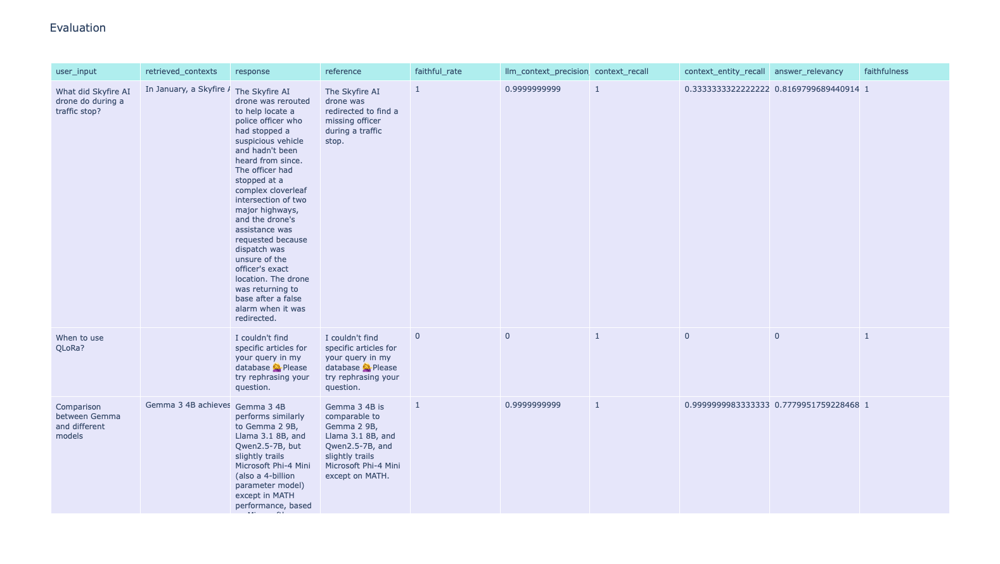

# MultRAG: AI Chatbot for DeepLearning.AI The Batch Articles

## Overview

MultRAG (Multi-modal Retrieval Augmented Generation) is an AI chatbot designed to answer questions specifically about articles from DeepLearning.AI's "The Batch" newsletter. It leverages a combination of text embeddings and generated image descriptions to provide comprehensive and contextually relevant answers. The chatbot is built using Streamlit for the user interface and integrates with Google's Gemini-1.5-Flash model for natural language generation.

## Features

- **Intelligent Text Retrieval:** Uses Weaviate vector store with BAAI/bge-base-en-v1.5 embeddings to find the most relevant article snippets based on user queries.
- **Image Contextualization:** Generates descriptions for images using Google's Gemini-1.5-Flash, and then uses these descriptions (embedded with BAAI/bge-base-en-v1.5) to find and display images semantically related to the user's question.
- **Context-Aware Responses:** Generates answers using Google's Gemini-1.5-Flash model, informed by retrieved text context and chat history.
- **Structured Output:** Presents answers, relevant images, and source links in a clear, organized manner.
- **Dynamic Data Collection:** Includes scripts to scrape and process articles from "The Batch" website.

## Setup Instructions

### 1. Clone the Repository
```bash
git clone [https://github.com/yanakravrts/MultRAG.git](https://github.com/yanakravrts/MultRAG.git)
```

### 2. Set Up Virtual Environment

It's highly recommended to use a virtual environment to manage project dependencies.
```bash
python3 -m venv venv
source venv/bin/activate  
```
### 3. Install Dependencies
```bash
pip install -r requirements.txt
```
### 4. Configure Environment Variables

##### .env
```bash
GOOGLE_API_KEY = YOUR_GEMINI_API_KEY
WEAVIATE_API_KEY = "YOUR_WEAVIATE_API_KEY"
WEAVIATE_URL = "YOUR_WEAVIATE_URL"
pip install -r requirements.txt
```
### 5. Data Collection and Embedding Generation

#### a. Collect Raw Article Data

This script scrapes article content and image URLs from the DeepLearning.AI "The Batch" website and saves them to data/raw/article_data.json.

python3 fetch_articles.py

#### b. Generate image description

python3 image_to_text.py

#### c. Generate Media Embeddings

python3 media_embeddings.py

### 6. Run the Application

streamlit run app.py


## Usage
Type your questions related to DeepLearning.AI "The Batch" articles into the input field.
The chatbot will retrieve relevant text snippets and images, and generate an answer.
Sources (article links) and a relevant image will be displayed below the generated answer.

## Evaluation

