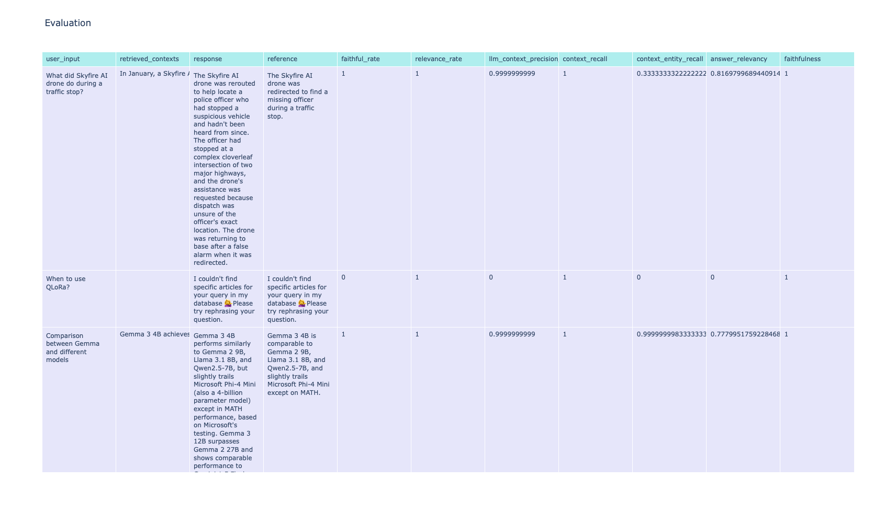

# MultRAG: AI Chatbot for DeepLearning.AI The Batch Articles

## Overview 🕵‍♀️

MultRAG (Multimodal Retrieval Augmented Generation) is an AI chatbot designed to answer questions specifically about articles from DeepLearning.AI's "The Batch" newsletter. It leverages a combination of text embeddings and generated image descriptions to provide comprehensive and contextually relevant answers. The chatbot is built using Streamlit for the user interface and integrates with Google's Gemini-1.5-Flash model for natural language generation.

## Features 🧚‍♂️

- **Intelligent Text Retrieval:** Uses Weaviate vector store with BAAI/bge-base-en-v1.5 embeddings to find the most relevant article snippets based on user queries.
- **Image Contextualization:** Generates descriptions for images using Google's Gemini-1.5-Flash, and then uses these descriptions (embedded with BAAI/bge-base-en-v1.5) to find and display images semantically related to the user's question.
- **Context-Aware Responses:** Generates answers using Google's Gemini-1.5-Flash model, informed by retrieved text context and chat history.
- **Structured Output:** Presents answers, relevant images, and source links in a clear, organized manner.
- **Dynamic Data Collection:** Includes scripts to scrape and process articles from "The Batch" website.

## Setup Instructions

### 1. Clone the Repository
```bash
git clone https://github.com/yanakravrts/MultRAG.git
```

### 2. Set Up Virtual Environment

It's highly recommended to use a virtual environment to manage project dependencies.
```bash
python3 -m venv venv
source venv/bin/activate  
```
### 3. Install Dependencies
```bash
pip install -r requirements.txt
```
### 4. Configure Environment Variables

##### .env
```bash
GOOGLE_API_KEY = YOUR_GEMINI_API_KEY
WEAVIATE_API_KEY = "YOUR_WEAVIATE_API_KEY"
WEAVIATE_URL = "YOUR_WEAVIATE_URL"
```
```bash
pip install -r requirements.txt
```
### 5. Data Collection and Embedding Generation

#### a. Collect Raw Article Data

This script scrapes article content and image URLs from the DeepLearning.AI "The Batch" website and saves them to data/raw/article_data.json.
```bash
python3 fetch_articles.py
```
#### b. Generate image description
```bash
python3 image_to_text.py
```
#### c. Merge image description with articles
```bash
python3 merge_img_txt.py
```
#### d. Generate embeddings and save to DB
```bash
python3 text_embeddings.py
```
### 6. Run the Application
```bash
streamlit run app.py
python3 text_embeddings.py
```

## Usage
Type your questions related to DeepLearning.AI "The Batch" articles into the input field.
The chatbot will retrieve relevant text snippets and images, and generate an answer.
Sources (article links) and a relevant image will be displayed below the generated answer.

## Evaluation 🧝‍♀️
### All metrics are used from Ragas - library that provides tools to supercharge the evaluation of Large Language Model (LLM) applications.

### faithful_rate - MultiModalRelevance metric measures the relevance of the generated answer against both visual and textual context. It is calculated from the user input, response, and retrieved contexts (both visual and textual). The answer is scaled to a (0,1) range, with higher scores indicating better relevance.

### relevance_rate - MultiModalRelevance metric measures the relevance of the generated answer against both visual and textual context. It is calculated from the user input, response, and retrieved contexts (both visual and textual). The answer is scaled to a (0,1) range, with higher scores indicating better relevance.

### llm_context_precision_without_reference - Context Precision is a metric that measures the proportion of relevant chunks in the retrieved_contexts. It is calculated as the mean of the precision@k for each chunk in the context. Precision@k is the ratio of the number of relevant chunks at rank k to the total number of chunks at rank k.

### context_recall - Context Recall measures how many of the relevant documents (or pieces of information) were successfully retrieved. It focuses on not missing important results. Higher recall means fewer relevant documents were left out.

### context_entity_recall - ContextEntityRecall metric gives the measure of recall of the retrieved context, based on the number of entities present in both reference and retrieved_contexts relative to the number of entities present in the reference alone. 

### answer_relevancy - The ResponseRelevancy metric measures how relevant a response is to the user input. Higher scores indicate better alignment with the user input, while lower scores are given if the response is incomplete or includes redundant information.

### faithfulness - The Faithfulness metric measures how factually consistent a response is with the retrieved context. It ranges from 0 to 1, with higher scores indicating better consistency.